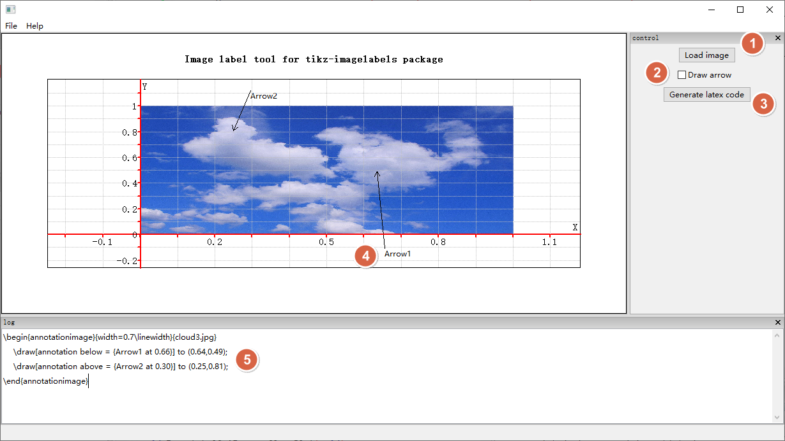

# image-label-gui

This is a GUI tool to quickly add annotations for an image. It try to support the Latex package: [tikz-imagelabels package](https://github.com/tcpluess/tikz-imagelabels) or [tikz-imagelabels – Put labels on images using TikZ](https://ctan.org/pkg/tikz-imagelabels?lang=en)

* An image can be loaded by click the "Load image" button, or you can just drag and drop the image to the main frame.

* When the "Draw arrow" check box is enabled, you can use the mouse to draw arrows in the image window.

* When the "Generate latex code" button get clicked, the Latex code will shown in the bottom "log" window.

* When "Draw arrow" mode is enabled, you can use the left mouse drag to draw a new arrow object in the image window. When you use the right mouse click and drag, you can drag the existing arrow object. When double clicked on the arrow's label, you can modify the text label of the arrow.

* In the bottom of the main frame, is the generated Latex code, you can copy and paste the code to your Latex document.

# How to build this tool

I use Code::Blocks as the IDE, MSYS2's MinGW64 gcc compiler and the wxWidgets 3.2 library for the GUI framework. You can just open the `ImageLabelGui.cbp` file inside the IDE, and press the "Build" button to build the project.

* Code::Blocks can be found here: [Releases · asmwarrior/x86-codeblocks-builds](https://github.com/asmwarrior/x86-codeblocks-builds/releases), note that when you unzip the package, you should run the `CbLauncher.exe`, so that the setting files will be saved in the same folder as the `codeblocks.exe`.

* [Package: mingw-w64-x86_64-wxwidgets3.2-msw - MSYS2 Packages](https://packages.msys2.org/packages/mingw-w64-x86_64-wxwidgets3.2-msw), this should be installed on your MSYS2's environment.

* [eranif/wx-config-msys2: wx-config tool for MSYS2 based installation of wxWidgets using the mingw64 repository](https://github.com/eranif/wx-config-msys2), this is the tool to automatically generate the include header file search path and library search path, also the correct linker options for wxWidgets.

* In the Code::Blocks's setting Menu->Settings->Global variable editor dialog. You should add one entry, which is named `wx_config`, and its base path(value) should be `wx-config-msys2.exe --prefix=$(TARGET_COMPILER_DIR)`, so that when you compiling, you can get the correct compiler and linker options. In the Menu->Settings->Compiler settings, in the global compiler setting dialog, your compiler's installation directory should point to the installed folder for your MSYS2's gcc compiler, in my environment, it could be `D:\msys2\mingw64`.