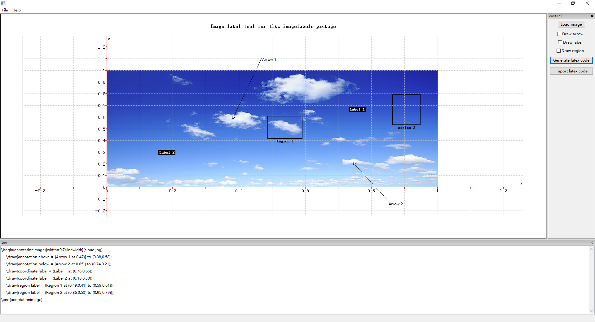
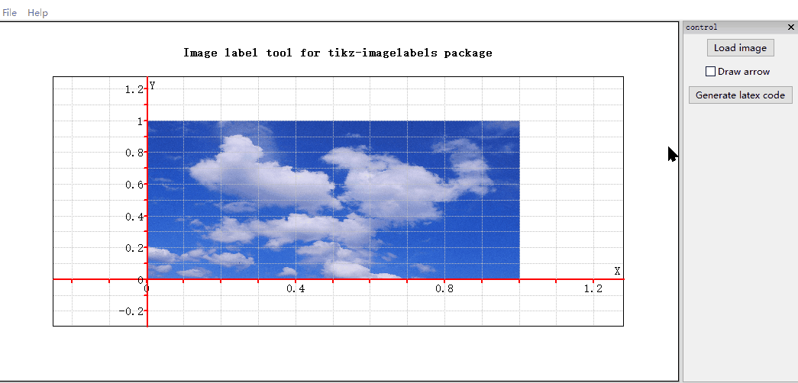
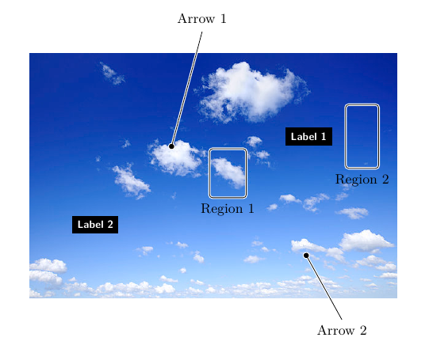
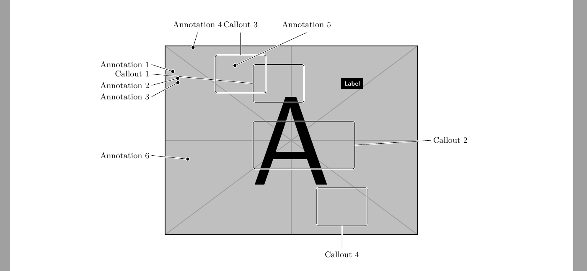

# image-label-gui

This is a GUI tool to quickly add annotations for an image. It tries to support the Latex package: [tikz-imagelabels package](https://github.com/tcpluess/tikz-imagelabels) or [tikz-imagelabels – Put labels on images using TikZ](https://ctan.org/pkg/tikz-imagelabels?lang=en)



# Download

You do not have to build the tool yourself. There is a GitHub action (see `.github/workflows/windows-msys2-64bit.yml`) which builds a Windows 64 bit package in the MSYS2 UCRT64 environment and publishes it as a new release.

* Open the [Releases](https://github.com/asmwarrior/image-label-gui/releases) page and download the `image-label-gui-win64-ucrt.zip` file of the newest release.

* Unzip the file and run `ImageLabelGui.exe`. All the needed DLLs (wxWidgets and the runtime libraries) are already included in the ZIP, so no extra setup is required.

* The workflow is started manually, so a new release only shows up when the author triggers it.

# How to use the tool

* An image can be loaded by clicking the "Load image" button, or you can just drag and drop the image file to the main frame.

* There are three drawing modes, which are switched on by the three check boxes on the right side of the main frame. Only one of them can be active at a time:

    * **Draw arrow**: use the left mouse button to drag a new arrow. When the mouse button is released, a dialog asks for the label text of the arrow. Use the right mouse button to drag the arrow itself or one of its two end points, and double click with the right mouse button to edit the label text.

    * **Draw label**: a simple click with the left mouse button places a new "coordinate label" straight on the image, a dialog asks for its text. Use the right mouse button to drag the label to another position, and double click with the right mouse button to edit its text.

    * **Draw region**: use the left mouse button to drag a rectangle, a dialog asks for the text which is drawn below the rectangle. Use the right mouse button to drag the whole rectangle to another position, or to drag one of its four corners to resize it. Double click with the right mouse button to edit its text.

* When the "Generate latex code" button is clicked, the Latex code of all the annotations will be shown in the bottom "log" window. You can copy and paste the code to your Latex document.

* When the "Import latex code" button is clicked, a dialog shows up where you can paste the Latex code back in. The tool parses the code and recreates the arrows, the coordinate labels and the regions, so you can adjust them with the mouse again instead of creating them from scratch.

# see the gif animation for adding and editing the arrows



# The generated Latex code

For a loaded image `cloud.jpg`, the tool generates something like this:

```latex
\begin{annotationimage}{width=0.7\linewidth}{cloud.jpg}
    \draw[annotation above = {Arrow 1 at 0.47}] to (0.38,0.58);
    \draw[annotation below = {Arrow 2 at 0.85}] to (0.74,0.21);
    \draw[coordinate label = {Label 1 at (0.76,0.66)}];
    \draw[coordinate label = {Label 2 at (0.18,0.30)}];
    \draw[region label = {Region 1 at (0.49,0.41) to (0.59,0.61)}];
    \draw[region label = {Region 2 at (0.86,0.53) to (0.95,0.79)}];
\end{annotationimage}

```

All the coordinates are normalized image coordinates, that is `(0,0)` is the bottom left corner and `(1,1)` is the top right corner of the loaded image.

# The "region label" key

The `region label` key is **not** part of the original `tikz-imagelabels` package, it is added by this tool. To be able to compile the generated code, please add the following definitions to the preamble of your Latex document:

```latex
\usetikzlibrary{fit, calc}

% a region is a rectangle, the white preaction gives the same double
% bordered line as the annotation arrows of the package
\tikzset{
  region box/.style = {
    rounded corners = 2pt,
    fill = none,
    preaction = {
      draw = white,
      line width = 2*\borderthickness + \arrowthickness,
    },
    draw = black,
    line width = \arrowthickness
  },
  region text/.style = {
    font = \annotationfont,
    text = black,
    inner sep = 2pt,
    anchor = north
  }
}

\imagelabelset{
  region label/.style args = {#1 at (#2) to (#3)}{
    insert path = {
      node[region box, fit={(#2) (#3)}, inner sep=0pt] (rNode) {}
      node[region text] at (rNode.south) {#1}
    }
  }
}
```

# The full tex code
```latex
\documentclass{article}
\usepackage{graphicx}
\usepackage{tikz-imagelabels} % Original unmodified .sty package

\usetikzlibrary{fit, calc}

% -------------------------------------------------------------
% Register 'region label' with double-bordered lines (matching preaction in .sty)
% -------------------------------------------------------------
\tikzset{
    % Region box style: uses preaction to achieve the same "black line + white outer border" as annotation arrows
    region box/.style = {
        rounded corners = 2pt,
        fill = none,
        % 1. Bottom layer: draw thicker white stroke for contrast/outline
        preaction = {
            draw = white,
            line width = 2*\borderthickness + \arrowthickness,
        },
        % 2. Top layer: draw standard black main line
        draw = black,
        line width = \arrowthickness
    },
    % Text style: inherits font and color settings from original annotation style
    region text/.style = {
        font = \annotationfont,
        text = black,
        inner sep = 2pt,
        anchor = north
    }
}

% Register region label key into the /imagelabels namespace
\imagelabelset{
    region label/.style args = {#1 at (#2) to (#3)}{
        insert path = {
            node[region box, fit={(#2) (#3)}, inner sep=0pt] (rNode) {}
            node[region text] at ([yshift=-1.5pt]rNode.south) {#1}
        }
    }
}
% -------------------------------------------------------------

\begin{document}
    
\begin{annotationimage}{width=0.7\linewidth}{cloud.jpg}
    \draw[annotation above = {Arrow 1 at 0.47}] to (0.38,0.58);
    \draw[annotation below = {Arrow 2 at 0.85}] to (0.74,0.21);
    \draw[coordinate label = {Label 1 at (0.76,0.66)}];
    \draw[coordinate label = {Label 2 at (0.18,0.30)}];
    \draw[region label = {Region 1 at (0.49,0.41) to (0.59,0.61)}];
    \draw[region label = {Region 2 at (0.86,0.53) to (0.95,0.79)}];
\end{annotationimage}
    
\end{document}
```

And here is the result pdf build by the latex.



# add the callout component support in the GUI tool, and here is the tex code and image shot:
```
\documentclass{article}
\usepackage{graphicx}
\usepackage{tikz-imagelabels}
\usepackage{etoolbox}

\usetikzlibrary{fit, calc, arrows.meta}

\imagelabelset{
  arrow distance = 0pt,
  annotation font = \normalfont\small,
}

% -------------------------------------------------------------
% Make annotationimage use only the original image as the
% layout bounding box.
% -------------------------------------------------------------
\patchcmd{\endannotationimage}
  {\end{scope} \end{tikzpicture}}
  {\end{scope}%
   \pgfresetboundingbox
   \path (image.south west) rectangle (image.north east);%
   \end{tikzpicture}}
  {\typeout{tikz-imagelabels: bounding box patch applied}}
  {\PackageError{tikz-imagelabels}{Bounding box patch failed}{}}

% -------------------------------------------------------------
% Define Callout Region styles.
% -------------------------------------------------------------
\tikzset{
  callout box/.style = {
    rounded corners = 2pt,
    draw = black,
    line width = 0.4pt,
    preaction = {draw = white, line width = 1.6pt}
  },
  callout line/.style = {
    draw = black,
    line width = 0.4pt,
    preaction = {draw = white, line width = 1.6pt}
  }
}

% Define custom region callouts for four directions.
\imagelabelset{
  % Left-side callout: the label is placed to the left of the image.
  region callout left/.style args = {#1 at #2 to (#3) to (#4)}{
    insert path = {
      node[callout box, fit={(#3) (#4)}, inner sep=0pt] (cBox) {}
      (0, #2) ++(-\labeloutersep, 0) node[annotation node, anchor=east] (cText) {#1}
      (cText.east) edge[callout line] (cBox.west)
    }
  },
  % Right-side callout: the label is placed to the right of the image.
  region callout right/.style args = {#1 at #2 to (#3) to (#4)}{
    insert path = {
      node[callout box, fit={(#3) (#4)}, inner sep=0pt] (cBox) {}
      (1.0, #2) ++(\labeloutersep, 0) node[annotation node, anchor=west] (cText) {#1}
      (cText.west) edge[callout line] (cBox.east)
    }
  },
  % Top-side callout: the label is placed above the image.
  region callout above/.style args = {#1 at #2 to (#3) to (#4)}{
    insert path = {
      node[callout box, fit={(#3) (#4)}, inner sep=0pt] (cBox) {}
      (#2, 1.0) ++(0, \labeloutersep) node[annotation node, anchor=south] (cText) {#1\strut}
      (cText.south) edge[callout line] (cBox.north)
    }
  },
  % Bottom-side callout: the label is placed below the image.
  region callout below/.style args = {#1 at #2 to (#3) to (#4)}{
    insert path = {
      node[callout box, fit={(#3) (#4)}, inner sep=0pt] (cBox) {}
      (#2, 0) ++(0, -\labeloutersep) node[annotation node, anchor=north] (cText) {#1\strut}
      (cText.north) edge[callout line] (cBox.south)
    }
  }
}

% -------------------------------------------------------------

\begin{document}

\begin{center}

\begin{annotationimage}{width=0.8\linewidth}{example-image-a}

\draw[region callout left={Callout 1 at 0.85 to (0.35,0.70) to (0.55,0.90)}];

\draw[region callout right={Callout 2 at 0.50 to (0.35,0.35) to (0.75,0.60)}];

\draw[region callout above={Callout 3 at 0.3 to (0.20,0.75) to (0.40,0.95)}];

\draw[region callout below={Callout 4 at 0.7 to (0.60,0.05) to (0.80,0.25)}];

  \draw[annotation left = {Annotation 1 at 0.90}]
    to (0.04,0.86);

  \draw[annotation left = {Annotation 2 at 0.79}]
    to (0.06,0.83);

  \draw[annotation left = {Annotation 3 at 0.73}]
    to (0.06,0.81);

  \draw[annotation above = {Annotation 4 at 0.13}]
    to (0.11,0.98);

  \draw[annotation above = {Annotation 5 at 0.56}]
    to (0.27,0.89);

  \draw[annotation left = {Annotation 6 at 0.42}]
    to (0.1,0.4);
    
  \draw[coordinate label = {Label at (0.74,0.80)}];

\end{annotationimage}

\end{center}

\end{document}
```

The result:




# How to build this tool

I use Code::Blocks as the IDE, MSYS2's MinGW64 gcc compiler and the wxWidgets 3.2 library for the GUI framework. You can just open the `ImageLabelGui.cbp` file inside the IDE, and press the "Build" button to build the project.

* Code::Blocks can be found here: [Releases · asmwarrior/x86-codeblocks-builds](https://github.com/asmwarrior/x86-codeblocks-builds/releases), note that when you unzip the package, you should run the `CbLauncher.exe`, so that the setting files will be saved in the same folder as the `codeblocks.exe`.

* [Package: mingw-w64-x86_64-wxwidgets3.2-msw - MSYS2 Packages](https://packages.msys2.org/packages/mingw-w64-x86_64-wxwidgets3.2-msw), this should be installed on your MSYS2's environment.

* [eranif/wx-config-msys2: wx-config tool for MSYS2 based installation of wxWidgets using the mingw64 repository](https://github.com/eranif/wx-config-msys2), this is the tool to automatically generate the include header file search path and library search path, also the correct linker options for wxWidgets.

* In the Code::Blocks's setting Menu->Settings->Global variable editor dialog. You should add one entry, which is named `wx_config`, and its base path(value) should be `wx-config-msys2.exe --prefix=$(TARGET_COMPILER_DIR)`, so that when you compiling, you can get the correct compiler and linker options. In the Menu->Settings->Compiler settings, in the global compiler setting dialog, your compiler's installation directory should point to the installed folder for your MSYS2's gcc compiler, in my environment, it could be `D:\msys2\mingw64`.
